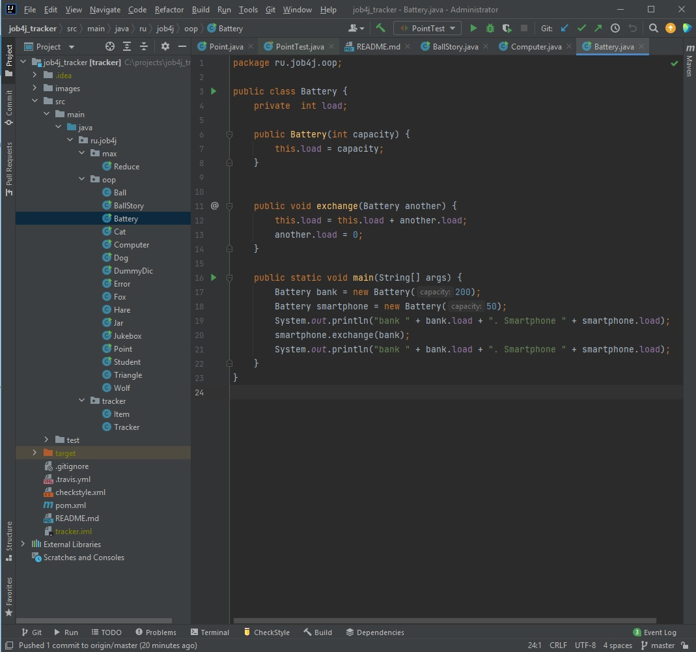
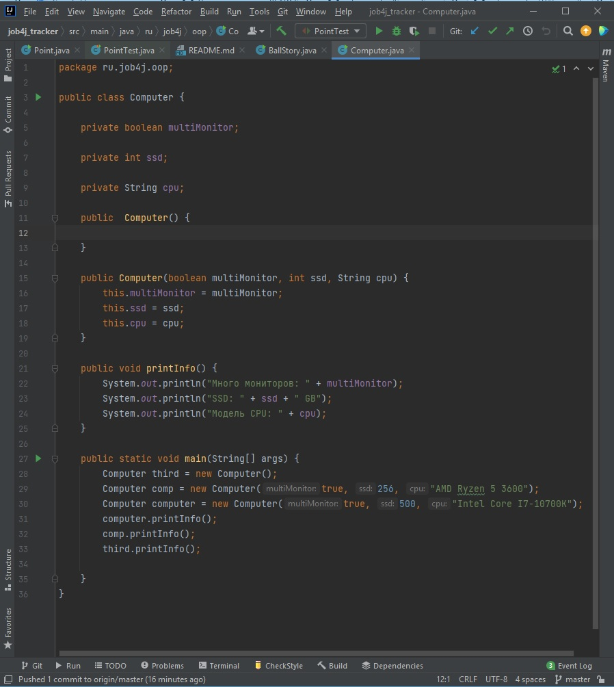

# Tracker
### Это учебный проект по изучению ООП

   Этот проект - консольное приложение. Пользователю отображается меню с возможностями программы.
   
   Программа может:
   
    1.Добавлять заявку.
    
    2.Заменять заявку на новую заявку по ID.
    
    3.Удалять заявку по ID.
    
    4.Отображать список всех заявок.
    
    5.Производить поиск по имени заявки.

**Задача - Состояние объекта**

**Задача - Конструктор**

